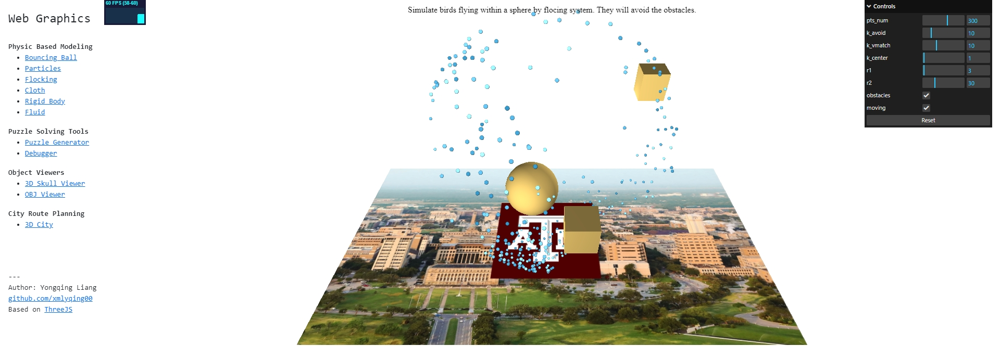

# WebGLProjects

Screenshot:

---
A collection of my graphics projects. They are implemented in ThreeJS and WebGL. Online demos are here: [https://xmlyqing00.github.io/WebGLProjects/](https://xmlyqing00.github.io/WebGLProjects/).

The list of the project names:

1. Physical Based Modeling:
    1. Bouncing ball
    2. Particles
    3. Flocking system
    4. Cloth simulation
    5. Rigid body dynamics
    6. Fluid simulation

2. Puzzle Solving Tools:
    1. Puzzle Generator
    2. Debugger

3. Objects Viewer:
    1. 3D Skull Viewer
    2. OBJ Viewer

4. City Route Planning
    1. 3D City
